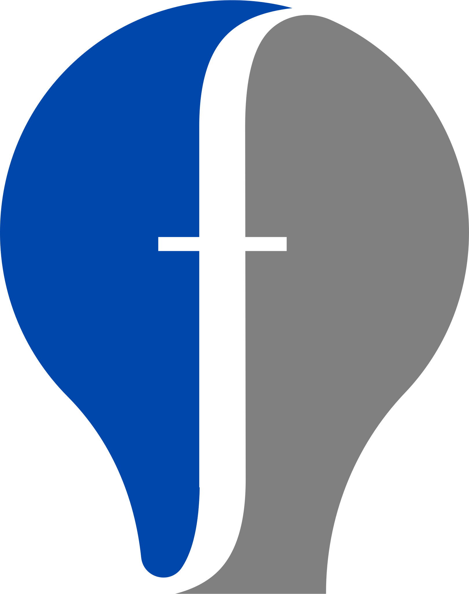
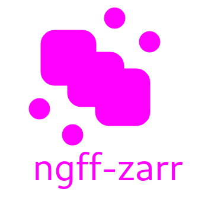

# Scientific AI and the Future of OME-Zarr
## Building Intelligent Bioimage Analysis Workflows

**Matt McCormick, PhD**
*fideus labs*

EMBL Advanced Methods in Bioimage Analysis
September 17, 2025

<style>
img[alt~="center"] {
  display: block;
  margin: 0 auto;
}
</style>
---

## Today's Journey

**50 minutes + 10 minutes Q&A**

1. **Extended introduction to ngff-zarr** (15 min)
   - Converting bioimages to OME-Zarr

2. **Introduction to MCP Servers** (15 min)
   - Add the ngff-zarr MCP server to agentic AI tools

3. **The ngff-zarr MCP Server in Action** (15 min)
   - AI-powered conversions and batch processing

4. **fideus labs introduction** (5 min)

---

# Part 1: Introduction to ngff-zarr
*Next-Generation Scientific Imaging*

---


## What is [OME-Zarr](https://ngff.openmicroscopy.org)?

* **Cloud-native** bioimaging file format
* Built on **Zarr** - chunked, compressed array storage
* **Multiscale** pyramidal data structure
* **Interoperable** across platforms and tools
* **FAIR** data principles: Findable, Accessible, Interoperable, Reusable

---

## Why OME-Zarr Matters

**Traditional Problems:**
- 🏭 Vendor-specific proprietary formats
- 📦 Monolithic files difficult to stream
- ☁️ Limited cloud compatibility
- 🐢 Poor scalability for large datasets

**OME-Zarr Solutions:**
- 📖 Open specification
- 🧩 Chunked data access
- 🌐 Cloud-optimized storage
- ⚡ Parallel processing friendly

<!--
footer: '[](https:/fideus.io)'
-->

---

## What is ngff-zarr?

* [**ngff-zarr**](https://ngff-zarr.readthdocs.io) is an *lean and kind* open-source toolkit for working with OME-Zarr, the next-generation file format for scientific imaging.
* Provides **command-line**, **Python**, and **TypeScript** interfaces for converting, validating, optimizing, and analyzing bioimaging data.
* Developed by the OME-Zarr and ITK communities for **interoperability** and **performance**.
* Supports a wide range of scientific image formats and workflows.



<!--
footer: '[](https://fideus.io)&nbsp;&nbsp;&nbsp;&nbsp;&nbsp;&nbsp;Matt McCormick, PhD | fideus labs | EMBL BIA 2025'
-->
---

## What can ngff-zarr do for you?

- 🔄 **Convert** your scientific images (NRRD, TIFF, HDF5, and more) to OME-Zarr for scalable, cloud-ready storage.
- ✅ **Validate** OME-Zarr datasets to ensure compliance and interoperability.
- 🛠️ **Optimize** chunking and compression for efficient access and storage.
- 🤖 **Integrate** with AI and analysis tools via the Model Context Protocol (MCP).
- 🚀 **Automate** batch processing and reproducible workflows for large-scale projects.

---

## 🛠️ Hands-On: Converting bioimages to OME-Zarr

---


### 📦 Prerequisites: Reproducible software environment with Pixi

---

**Open GitHub Codespace:**
`https://github.com/fideus-labs/scientific-ai-omezarr-tutorial`

**Convert with ngff-zarr:**
```bash
# Install ngff-zarr
pip install 'ngff-zarr[cli]'

# Convert NRRD to OME-Zarr
ngff-zarr -i sample-data/brain.nrrd -o brain.ome.zarr

# Inspect the result
ngff-zarr -i brain.ome.zarr
```

---

## What Just Happened?

- **Automatic multiscale generation** - 4 resolution levels
- **Intelligent chunking** - optimized for access patterns  
- **Metadata preservation** - spatial information maintained
- **Compression applied** - reduced file size
- **Cloud-ready format** - can be served via HTTP

---

# Part 2: Introduction to MCP Servers
*Connecting AI to Your Data*

---

## What is the Model Context Protocol (MCP)?

**Universal standard** for connecting AI assistants to external data and tools

**Key Components:**
- **MCP Client** - integrated in AI applications
- **MCP Server** - exposes specific capabilities  
- **Transport Layer** - JSON-RPC 2.0 communication
- **Standardized Interface** - tools, resources, prompts

---

## MCP Architecture

```
AI Application (Qodo, Claude, etc.)
    ↕️ JSON-RPC 2.0
MCP Client
    ↕️ STDIO/HTTP
MCP Server (ngff-zarr)
    ↕️
Scientific Data & Tools
```

**Benefits:**
- Single protocol for all integrations
- Bidirectional communication
- Context-aware AI interactions

---

## Why MCP for Scientific Computing?

**Before MCP:**
- Custom integrations for each tool
- Limited AI access to scientific data
- Manual, error-prone workflows

**With MCP:**
- **Natural language** interface to scientific tools
- **Automated** data processing pipelines  
- **AI-driven** optimization and analysis
- **Reproducible** computational workflows

---

## 🛠️ Hands-On: Configure Qodo with MCP

**In VS Code with Qodo Extension:**

1. **Install ngff-zarr MCP server:**
```bash
pip install 'ngff-zarr[mcp]'
```

2. **Configure Qodo settings:**
   - Open Qodo settings
   - Enable "Agentic Mode"
   - Add ngff-zarr MCP server endpoint

3. **Test the connection:**
   - Open Qodo chat
   - Ask: "What MCP servers are available?"

---

# Part 3: The ngff-zarr MCP Server
*AI-Powered Scientific Image Processing*

---

## ngff-zarr MCP Server Capabilities

**Core Functions:**
- Convert scientific formats to OME-Zarr
- Inspect and validate OME-Zarr stores  
- Optimize compression and chunking
- Generate processing scripts
- Batch operation planning

**AI Integration:**
- Natural language commands
- Intelligent parameter selection
- Automated workflow generation

---

## 🛠️ Hands-On: AI-Powered Conversion

**Let's convert NRRD with AI assistance:**

In Qodo chat:
```
"Convert the brain.nrrd file to OME-Zarr format and 
find the optimal compression codec for this type of data"
```

**Watch the AI:**
1. Analyze the input file
2. Select appropriate parameters
3. Execute the conversion
4. Report optimization results

---

## 🛠️ Hands-On: Examine Contents

**Ask the AI to explore:**

```
"Examine the contents of brain.ome.zarr and tell me 
about its structure, dimensions, and metadata"
```

**The AI will:**
- Inspect multiscale levels
- Report spatial metadata
- Analyze chunk structure
- Suggest optimization opportunities

---

## 🛠️ Hands-On: Generate Batch Script

**Scale up with AI automation:**

```
"I have a folder of 50 similar NRRD files. 
Generate a Python script to batch convert them all 
to OME-Zarr with the same optimal settings"
```

**The AI creates:**
- Complete Python script
- Error handling
- Progress reporting  
- Optimized parameters from previous analysis

---

## The Future of Scientific AI

**Today's Demo Shows:**
- **Conversational** scientific computing
- **Automated** optimization
- **Reproducible** workflows
- **Accessible** advanced techniques

**Tomorrow's Possibilities:**
- Multi-modal analysis pipelines
- Intelligent experiment design
- Automated quality control
- Cross-platform integration

---

# Part 4: GitHub Codespaces Demo
*Cloud-Native Development*

---

## Why GitHub Codespaces?

**For Scientific Tutorials:**
- **Zero setup** - pre-configured environment
- **Consistent** across all participants
- **Scalable** - runs in the cloud
- **Reproducible** - version-controlled setup
- **Accessible** - works on any device

**Perfect for:**
- Workshop environments
- Educational content
- Collaborative research

---

## 🛠️ Live Demo: Complete Workflow

**We'll demonstrate:**

1. **Open Codespace** - instant development environment
2. **Install tools** - ngff-zarr + MCP server  
3. **Configure AI** - connect Qodo to MCP
4. **Process data** - convert sample datasets
5. **Generate code** - AI-created batch scripts
6. **Share results** - collaborative workflows

---

# fideus labs
*Computational Imaging Excellence*

---

## About fideus labs

**Mission:** Empowering researchers with precision-engineered computational imaging solutions

**Specialties:**
- **Medical Imaging** - ITK core development
- **Scientific Visualization** - advanced rendering
- **Cloud Infrastructure** - scalable processing
- **AI Integration** - intelligent workflows

**Open Source Leadership:**
- ITK (Insight Toolkit) core team
- OME-Zarr ecosystem contributor
- MCP server development

---

## Our Approach

**Quality-First Development:**
- Rigorous testing and validation
- Performance optimization
- Cross-platform compatibility
- Comprehensive documentation

**Research Partnership:**
- Government laboratories
- Academic institutions  
- Industry leaders
- Open source communities

---

## Connect With Us

**Matthew McCormick**
- GitHub: `@thewtex`
- Email: `matt@fideus.io`
- Web: `fideus.io`

**fideus labs Services:**
- Custom imaging solutions
- Scientific software development
- Cloud infrastructure design
- Training and consultation

---

## Key Takeaways

✅ **OME-Zarr** - Future of scientific imaging formats

✅ **MCP Servers** - Bridge AI and scientific tools  

✅ **Natural Language** - New interface for scientific computing

✅ **Reproducible Workflows** - AI-generated, version-controlled

✅ **Accessible Research** - Cloud-native, collaborative science

---

## Questions & Discussion

**What we covered:**
- OME-Zarr fundamentals and conversion
- MCP architecture and benefits  
- AI-powered scientific workflows
- Practical GitHub Codespaces setup

**Let's discuss:**
- Your specific use cases
- Integration challenges
- Future possibilities
- Next steps for implementation

---

## Resources

**Documentation:**
- OME-Zarr: `ngff.openmicroscopy.org`
- ngff-zarr: `ngff-zarr.readthedocs.io`
- MCP: `modelcontextprotocol.io`

**Code:**
- ngff-zarr: `github.com/thewtex/ngff-zarr`
- MCP examples: `github.com/modelcontextprotocol/servers`

**Community:**
- Image.sc Forum: `forum.image.sc`
- OME Community: `openmicroscopy.org`

---

# Thank You!

**Scientific AI and the Future of OME-Zarr**

*Building Intelligent Bioimage Analysis Workflows*

**Questions?**

fideus labs | EMBL BIA 2025